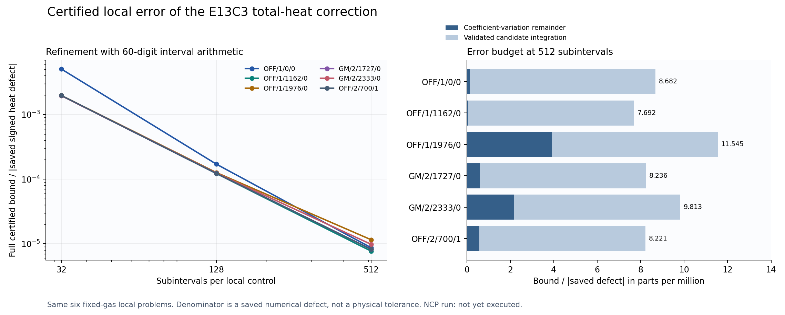

# BASS_HE E13C4 — 국소 보정 잔여오차의 검증된 상계

## 1. 이번 루프가 실제로 완성한 것

**E13C3의 같은 여섯 local initial-value problem에서 photon, HI/HeI/HeII absorption count, absorbed energy, species/total photoelectron heat 및 redshift correction의 오차 상계를 실제 계산했다.** 이번 산출물은 정확한 first coefficient-variation 식의 수학적 truncation과 저장된 유한 정밀도 후보의 적분·산술 오차를 분리하고, 두 항을 합쳐 true continuous-minus-exact-frozen defect와 저장 후보 사이의 상계를 제공한다. 기존 E13C2 continuous reference를 다시 풀지 않았다.

과학 계산과 국소 포함성 검산은 완료했다. 후보 생성자와 분리된 최종 decision은 `INDEPENDENT_REVIEW.json`과 `INDEPENDENT_REVIEW_KO.md`가 소유한다. 본 보고서는 그 판정을 자가 대체하지 않는다. Physical/production은 **HOLD**이며 actual atomic RCT 입력이나 receiver adoption을 확정하지 않는다.

512분할·60자리 결과에서 총 heat 후보 전체오차 상계는 저장 signed heat defect 절댓값의 약 **7.69234e-6–1.15454e-5**, 즉 약 **0.000769234–0.00115454%**다. 분모는 해당 spectral local control의 저장 defect이며 총 gas heating이나 우주론적 물리 오차 budget이 아니다. E13C3에서 관측한 약1e-8 규모의 잔여오차를 이번에 그 정확도 그대로 인증했다고 주장하지 않는다.

근거: `evidence/N512_P60.json`, `evidence/ACCEPTANCE.json`; 생성 식과 조건: `THEORY.md`. 문서 표의 양의 상계는 여섯 유효숫자에서 위쪽으로 반올림했다. 전체 유효 숫자와 모든 종별 값은 JSON에 있다.

## 2. 고정된 물리 문제와 입력의 의미

좌표는 u=s−s_a, s=ln(a), t=u/h∈[0,1]이며 에너지는 E(u)=E0 exp(−u)다. P는 inherited spectral node의 photons per H nucleus per dη 정규화다. Count도 같은 photon 정규화, B·H·Z는 eV를 곱한 정규화다. 이 보고서의 숫자에 spectral weight나 erg/eV 변환을 다시 곱하지 않았다. 필요 시 정확히 상속한 ε=1.602176634e−12 erg/eV를 사용한다.

연속 정의는 P′=q−ΛP, Λ=Σλ_i, λ_i=c n_target,i σ_i(E)/H다. Gas x,y,z는 저장 macro endpoints 사이의 affine path다. Proper density와 analytic FLRW H(s), Verner fit 상수·종별 cutoff, source band, inherited e0 anchor를 유지한다. Source는 현재 외부 R=1e−15 photons/(H nucleus·s), dN/dE∝E⁻² law다. 실제 atomic RCT spectrum을 넣은 것이 아니다.

q_f와 λ_if는 captured binary64 freezing을 exact lift한 값이고 L=Σλ_if다. Mathematical midpoint에서 재평가한 값으로 바꾸지 않았다. CSV 문자열은 우선 원래 binary64 값으로 읽은 뒤 Decimal.from_float로 정확히 올린다. 반면 저장된 70자리 result 문자열은 그대로 십진수로 읽는다. π 역시 원 구현의 binary64 math.pi를 올리며, 새 exact π를 도입하지 않았다. 국소 시작 stock은 captured f0, incoming correction은 정확한 0이다.

대상은 OFF/1/0/0, OFF/1/1162/0, OFF/1/1976/0, GM/2/1727/0, GM/2/2333/0, OFF/2/700/1이다. 마지막 control은 HeI cutoff 뒤의 source-on segment이며 그 고정 mask를 유지한다. 매 point마다 branch를 새로 선택하지 않는다. 끝점은 해당 branch의 한쪽 analytic extension으로 취급한다. 실제 active 종에 대해서만 E−χ_i≥0를 확인하므로 비활성 HeII의 χ를 HI-only 구간에 잘못 적용하지 않는다.

이번 증명 대상은 inherited coefficients의 **정확한 실수 해석**이다. 새로운 gas solution, native binary64 total output, threshold-event placement 자체의 오차, 모든 spectral node, 전체 first2 path를 동시에 인증한 것이 아니다. Native saved baseline에 correction을 더한 total output의 인증에는 exact-frozen/native-frozen representation 항을 따로 포함해야 한다.

## 3. 수학적 잔여오차와 보정 적분을 분리한다

Frozen solution P_f′+LP_f=q_f에 대해 δq=q−q_f, δλ_i=λ_i−λ_if, δΛ=Σδλ_i, r=δq−δΛP_f다. True defect e=P−P_f와 1차 보정 e1은

\[
e'+\Lambda e=r,\qquad e_1'+Le_1=r,\qquad e(0)=e_1(0)=0
\]

를 따른다. q, Λ, L, P_f의 비음수 조건을 실제 전체 cell enclosure로 확인했다. 그러면

\[
B_r=\int_0^h(|\delta q|+|\delta\Lambda|P_f)\,du,\quad
S=B_r,\quad \|e\|_\infty\le S.
\]

R=e−e1에 대해 R′+LR=−δΛe다. W=exp[−L(h−u)], K0=J(L,h−u), KE=E(u)J(L+1,h−u)를 쓰면 endpoint bound는 S∫W|δΛ|, redshift bound는 S∫KE|δΛ|다. J(L,a)=(1−exp(−La))/L, J(0,a)=a이며 작은 차이의 소거 손실도 interval endpoint에 포함한다.

종별 count remainder는

\[
R_{A_i}=\int_0^h[\delta\lambda_i-\lambda_{if}K_0\delta\Lambda]e\,du
\]

다. 따라서 결합 integrand의 절댓값을 whole-cell로 감싸면 S를 곱한 상계를 얻는다. Absorbed energy에는 Eδλ_i와 KE가 들어간다. Heat에서는 w_i=E−χ_i, K_Hi=KE−χ_iK0를 유지하여

\[
R_{H_i}=\int_0^h[w_i\delta\lambda_i-\lambda_{if}K_{H_i}\delta\Lambda]e\,du
\]

를 평가한다. 총 heat에는

\[
g_\delta=\sum_iw_i\delta\lambda_i,\quad
K_g=\sum_i\lambda_{if}K_{H_i},\quad
|R_{H,\mathrm{tot}}|\le S\int_0^h|g_\delta-K_g\delta\Lambda|\,du
\]

를 쓴다. 각 종의 w_i≥0가 확인된 경우 positive-weight triangle bound도 유효하므로 두 certified upper value 중 작은 값을 사용할 수 있다. Heat를 B와 χA로 나누어 절댓값 상계를 더할 때 생기는 불필요한 큰 소거 손실을 줄인다.

총 opacity 변화가0이어도 종별 오차가0인 것은 아니다. 새 exact toy는 δΛ=0인데 종별 count remainder가 +1/24,−1/24이고 총 heat remainder는 +1/24 eV인 사례를 포함한다. Aggregate photon ledger의 closure만으로 species heat를 보증할 수 없다. Source QN/QE의 coefficient truncation은 정확히0이며, 저장 후보와 비교할 때에는 source 적분의 수치 enclosure 폭이 여전히 남는다.

## 4. Outward rounding과 실제 적분 인증

기본 +,−,×,÷는 별도 Decimal FLOOR/CEILING context를 사용한다. 입력 생성·부호 반전은 ambient context에 의해 잘리지 않도록 처리한다. Python Decimal의 exp와 ln은 correctly rounded HALF_EVEN 결과를 제공하므로 각 endpoint 결과의 바로 바깥 representable neighbour로 넓힌다. Sqrt도 바깥 neighbour를 사용하고, 모든 호출에서 lower²≤입력≤upper²를 directed arithmetic으로 추가 확인한다. 일반 비정수 Decimal.power는 사용하지 않고 log–multiply–exp의 포함 연산을 쓴다. Overflow/underflow/nonfinite/부적절한 log·sqrt·division domain은 오류로 중단한다.

산술 보장의 1차 출처는 Python3.12 Decimal 문서의 exp/ln/rounding/next_minus/next_plus 항목과 General Decimal Arithmetic square-root 정의다. Runtime은 CPython3.12.14, libmpdec4.0.0이었다. 이는 문서화된 arithmetic semantics와 실행 구현을 전제로 하는 검증된 수치 bound이며 proof assistant에서 형식 검증한 결과는 아니다.

- Python Decimal: https://docs.python.org/3.12/library/decimal.html
- Decimal square-root specification: https://speleotrove.com/decimal/daops.html#refsqrt

절댓값이 들어간 D_L, B_r, weighted variation·effective remainder integrand에는 whole-cell interval Riemann enclosure를 사용한다. 이들은 내부 영점에서 미분 가능하지 않을 수 있으므로 midpoint derivative theorem을 적용하지 않는다.

Signed firstvariation 적분 Φ=h∫₀¹f(t)dt에는 interval automatic differentiation으로 각 cell 전체의 실제2차 도함수를 포함시킨다. 폭1/N인 cell의 midpoint 적분 오차는

\[
|\Phi-\Phi_{\rm mid}|\le
\sum_{j=0}^{N-1}\frac{h}{24N^3}\sup_{t\in I_j}|f''(t)|.
\]

Midpoint 값 자체도 interval로 계산하므로 합산·산술 반올림까지 포함된다. 따라서 정확한1차 보정 Φ1의 포함구간 J=[J−,J+]를 얻고, 저장 후보 C에 대해

\[
|\Phi_{\rm true}-C|\le B_{\rm rem}
+\max(|C-J_-|,|C-J_+|)
\]

를 쓴다. 우변 두 항이 각각 수학적 coefficient-variation truncation과 후보의 수치오차 상계다. 저장된 continuous reference 및 GL12/20 차이를 이 부등식의 증명 근거로 사용하지 않았다. 해당 reference는 수치적 compatibility 진단으로만 비교했다.

## 5. 실제 총 heat 결과

아래 값은 모두 한 local spectral control의 eV-normalized defect 단위다. 전체상계에는 signed midpoint quadrature의 검증된 잔차와 finite arithmetic이 포함되어 있다. 근거는 N512/P60 결과다.

| Local ID | 저장 signed heat defect | 수학적 잔여오차 상계 | 후보 전체오차 상계 | 전체상계 / 저장 defect 절댓값 |
|---|---:|---:|---:|---:|
| OFF/1/0/0 | -6.172113E-14 | 9.67012E-21 | 5.35841E-19 | 8.68165E-6 |
| OFF/1/1162/0 | -4.592915E-13 | 2.69453E-20 | 3.53303E-18 | 7.69234E-6 |
| OFF/1/1976/0 | 2.918182E-14 | 1.14186E-19 | 3.36915E-19 | 1.15454E-5 |
| GM/2/1727/0 | -3.019159E-13 | 1.82724E-19 | 2.48651E-18 | 8.23576E-6 |
| GM/2/2333/0 | 2.826989E-14 | 6.17283E-20 | 2.77426E-19 | 9.81347E-6 |
| OFF/2/700/1 | -1.297959E-12 | 7.55021E-19 | 1.06700E-17 | 8.22060E-6 |

위 여섯 상계는 실제 저장된 후보-reference 차이를 모두 포함한다. 다만 그 차이 자체가 reference의 진짜 수학적 오차를 보증하지는 않는다. E13C2 GL12/20 차이는 별도 `reference_order_gap_status=NUMERICAL_EVIDENCE_NOT_RIGOROUS_UNCERTAINTY`로 남겼다.

총 heat의 수학적 remainder bound는 저장 후보-reference gap보다 약31.85–1415.48배 크다. 엄밀성 확보와 sharpness를 같은 판정으로 취급하지 않았다. 전체상계의 대략66–99%는 후보 적분의 검증된 numerical interval에서 온다. 따라서 국소 상계를 더 좁히려면 다음에는 이 항의 구조를 먼저 검토하는 것이 합리적이다. 이번에는 결과를 본 뒤 N, precision 또는 기준을 바꾸어 수치를 꾸미지 않았다.

실제 quantity별 full-bound/reference-defect 절댓값 비율의 최댓값은 photon endpoint 약9.11206e−6, species counts 약1.02194e−5, species absorbed energy 약1.02194e−5, total heat 약1.15454e−5, redshift 약7.87770e−6다. Source number·energy도 각각약7.15305e−6,6.43390e−6 이하다. 이 값들은 physical budget이 아니라 현재 fixed inputs의 진단 비율이다. Number floor1e−25, energy/heat floor1e−24 eV 아래에서는 상대오차 및 sharpness를 `UNRESOLVED_BELOW_FLOOR`로 두고 절대값만 해석한다. 비활성 종은 적분과 remainder 모두 정확한0이다.



그림 왼쪽은32→128→512분할에서 전체상계가 좁아지는 정도, 오른쪽은512분할의 수학적 remainder와 candidate numerical enclosure 기여를 보여준다. 표시를 위한 float 변환은 plot에만 사용하며 certificate 값은 JSON의 십진 endpoint다.

## 6. 실행·독립성·실패 기록

사전 PLAN에 고정한 P60의 N32,128,512와 P80의 N32를 실제 실행했다. 네 실행 모두 source identity가 실행 중 유지됐고, saved reference compatibility 및 saved correction interval 포함 실패는0이었다. P60의 세 실행은 순차였다. P80 precision control은 P60/N128과 약3초 겹쳐 실행되었으므로 모든 작업이 serial이었다고 보고하지 않는다. 시간 비교를 controlled speedup으로 해석하지 않는다.

N512/P60은 6,144번 coefficient evaluation, 약35.9149초, peak RSS13,568KiB를 기록했다. P60/N32 약2.6644초, P60/N128 약9.3485초, P80/N32 약2.8704초였다. 새로운 primary 계산 시간 합은약50.7983초다. 모든 실행은 사전180초/회와1GiB RSS 예산 안이었다. RLIMIT_AS는 준비된 NCP runner가 적용하는 별도 가상주소공간 cap이며 이 RSS 숫자와 같지 않다.

검증의 역할은 다음과 같이 분리했다.

| 근거 | 실제 결과 | 의미 |
|---|---:|---|
| 새 exact rational/formal-exponential toy | 63 PASS | bound·kernel·incoming·midpoint 및 cancellation 반례 |
| 별도 contributor의 interval primitive/Jet2 | 386 PASS | Fraction 기준과 별도 도함수로 구현 진단 |
| 별도 contributor의 six-control coefficient | 632 PASS | 원 CSV 선택,110자리 coefficient·E/q derivative 포함 진단 |
| Owner saved-evidence audit | 448 PASS | source/exit/interval/ledger/floor/refinement 일관성 |
| NCP adapter synthetic boundary fixture | 7 PASS | fresh result/source mismatch, collision, timeout 처리; 과학 계산0 |

632개 coefficient fixture의 이식성 재현도 수행했으며 같은632를 독립 증거 수에 중복 가산하지 않았다. Primitive oracle은 Decimal exp/ln을 사용하지 않는 Fraction series·tail 및 정수 square-root enclosure다. Coefficient point 비교는 상속 fit·상수·경로와 Decimal 백엔드를 공유한다. 그 유한한 대조만으로 전체구간 증명을 대신하지 않는다. 전체구간 포함성의 근거는 식의 interval composition, 각 연산의 방향 반올림 및 유도된 적분 잔차다. Independent decision reviewer는 후보·기여 검산 작성자와 별도다.

최초 구현 실패는 J(0,−1)이 음수 폭을 거부하지 않은 입력-domain guard였다. 여섯 실제 물리 입력의 폭은 모두 양수였으며 값에는 영향이 없었다. 실패 당시 코드와 actual exit1을 보존했고, width guard를0-rate branch 앞으로 옮긴 뒤 독립 회귀검사386개가 통과했다. 구체적 증거는 `evidence/control/domain_01/`, `primitives_01/`에 있다. 물리 primary run의 최초 실패를 만들거나 숨기지 않았다. Synthetic negative tests의 예상 nonzero exit는 의도된 adapter 검사이며 새 물리 실패가 아니다.

실행 공간에 이전 파일이 없어 봉인 E13C3 archive를 복원한 일은 runtime recovery로 별도 기록했다. Archive SHA 및99 payload/89 review-bound identity를 확인했으며 이전 물리 solver는 재실행하지 않았다. `state/RECOVERY_INVENTORY.json`, `RESTORED_ARCHIVE_IDENTITIES.json`, `RESTORED_PAYLOAD_CHECK.json`에 관측과 조치를 남겼다.

## 7. NCP local Codex로 넘길 구체적인 일

`NCP_LOCAL_CODEX_HANDOFF_KO.md`는 그대로 전달할 수 있는 완전한 prompt이고 `NCP_EXECUTION_CONTRACT.json`은 같은 범위를 기계 판독 형식으로 담는다. 실행기는 `code/ncp_execute.py`다. Detached delivery receipt의 실제 `scientific_core_commit`과 봉인 archive를 사용하고, 새 worktree/output 경로에서 source lock 확인→host 검사→같은 여섯 N512/P60 계산1회→실제 새 output의 deterministic scientific projection 대조를 수행한다.

```bash
python3 code/ncp_execute.py --out /absolute/new/ncp_run_directory --execute --timeout 180
```

이 명령은 CPython3.12.x, process1, thread1, wall180초, RLIMIT_AS1GiB를 유지한다. 실제 CPU/affinity/quota/memory와 allowlisted thread/launcher 환경만 기록한다. 단순 binary64/Fortran 전환이나64 rank 확대는 현재 interval certificate를 보존하는 host replay가 아니므로 이 handoff에 넣지 않았다.

현재 ChatGPT에서 runner의 source/host 확인과 synthetic 경계 검사를 마쳤다. **NCP 실제 실행은 NOT_RUN**이다. `--execute` 없는 `VERIFY_ONLY_PASS`에는 `new_result_accuracy=NOT_EVALUATED`를 쓴다. 실제 새 결과를 읽고 lock 및 numerical projection이 맞을 때만 `PASS_SCOPED_HOST_PARITY`가 된다. 이전 saved-only wrapper와 달리 fresh output을 비교하는 경로를 명시적으로 검증했다. 마지막 wrapper 변경은 비민감 host 환경 metadata 기록4줄이며, 그에 대한 verify-only 관측을 따로 보존했다. 숫자 비교 경계는 이전 fixture as-run source와 동일하다.

## 8. 다음 과학 node와 보호 상태

다음 node는 **E13C5_FIXED_PATH_INCOMING_AND_ANCHOR_ENCLOSURE**, 상태는 `CHAT_RESEARCH_PENDING`이다. 국소 ea=0 인증을 전체 first2에 복사하는 방식은 사용할 수 없다. 다음에는 incoming η_a를 photon과 각 weighted moment로 전달하고, inherited energy reset에서 발생하는 (E_next,0−E_prev,h)·correction 및 그 오차를 함께 전파해야 한다. Native/exact-frozen representation 차이도 관측 대상에 맞게 별도로 제한해야 한다. 작은 seam/incoming controls와 독립 판정부터 설계해야 하며, 이번 NCP host replay에 그 설계를 넘기지 않았다.

고정 상태: `baseline_RCT=OFF`; actual atomic photon/heat/recoil `null`; physical/production `HOLD`; HE-F2/F09 `OPEN`; receiver adoption `SEPARATE`; legacy Gamma alias `3.543295 FAIL`. E13C4는 기존 gas algebraic TOL을 continuum/physical budget으로 바꾸지 않는다. Actual atomic RCT spectrum/moments, late k7/k59 photon stock은 별도의 열린 입력 node다.

## 9. 증거 상태와 전달 구조

| Claim | 상태 | 직접 근거 |
|---|---|---|
| Local weighted remainder identities | derived | THEORY.md, exact toy63 |
| Coefficient and integral enclosures | derived + implementation-verified | directed_interval/local_enclosure, four actual runs, independent controls |
| Saved candidate/reference compatibility | numerically checked | N512 result and acceptance448 |
| Published Decimal semantics | literature-supported | 위 두 primary documentation |
| NCP fresh-host numerical parity | unresolved, NOT_RUN | handoff and prepared runner; actual NCP output 필요 |
| Full-path/physical/RCT adoption | unresolved, HOLD/OPEN | NEXT_DAG.json, protected state |

봉인 payload에는 입력, 새 코드, actual START/checkpoint/logs, 독립 기여와 decision, 보고서·그림·NCP prompt를 포함한다. Git에는 검토 가능한 compact projection을 additive/non-force로 게시한다. Actual publication 및 Drive/Dropbox create-only backup은 과학 archive와 분리한 delivery receipt가 기록한다. Provider ACK/name/path/size 확인과 실제 remote restore를 구분하며, receipt 자체를 archive에 다시 넣어 순환 identity를 만들지 않는다.
